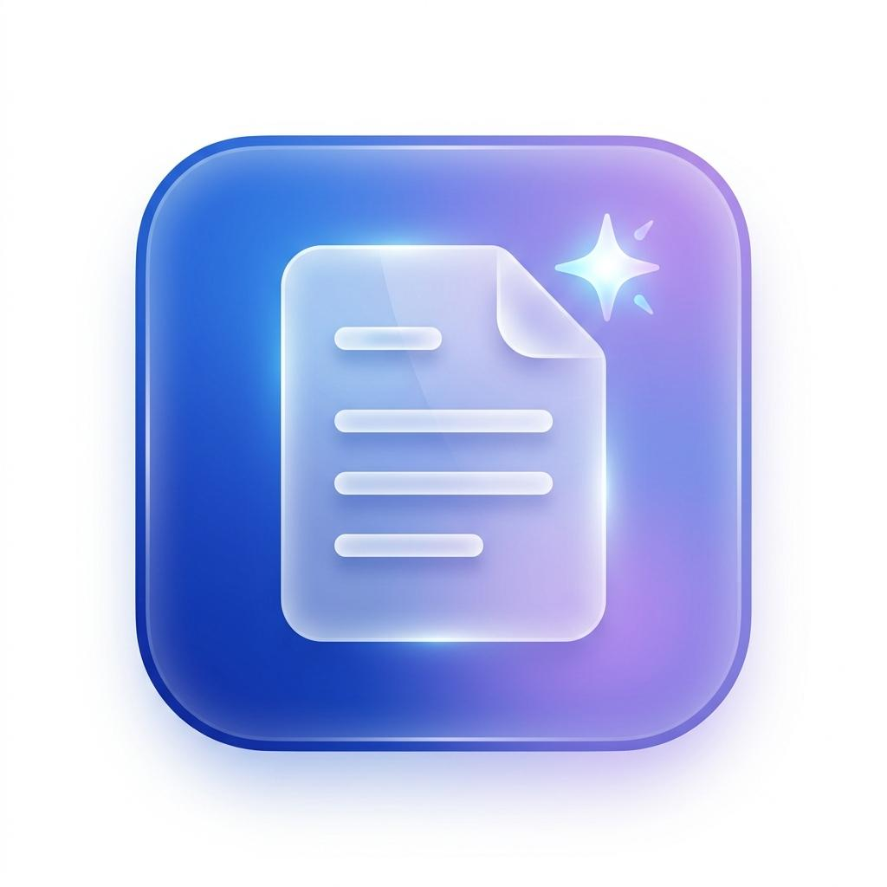

# 📄 تطبيق صورة — Soura
### مساعد المستندات الذكي الأول للمعلمين والطلاب في مصر 🇪🇬

<div align="center">



[](https://vitejs.dev/)
[](https://reactjs.org/)
[](https://tailwindcss.com/)
[](https://ai.google.dev/)
[](https://opensource.org/licenses/MIT)

**حوّل صور الملازم والكتب والكشوف الورقية إلى مستندات PDF، نصوص Word قابلة للتعديل، وامتحانات رسمية جاهزة للطباعة فوراً بتكلفة سيرفر 0$.**

[📱 تجربة العرض الحي](#-طريقة-التشغيل-السريع) • [✨ المميزات](#-المميزات-الرئيسية) • [🛠️ التقنيات المستخدمة](#-التقنيات-المستخدمة) • [🚀 التثبيت والتشغيل](#-التثبيت-والتشغيل-محلياً)

---

</div>

## 🌟 لماذا تطبيق صورة (Soura)؟

يعاني المعلمون والطلاب في مصر يومياً من تصوير الملازم، الامتحانات، وكشوف الدرجات بجودة ضعيفة، واستهلاك الكثير من حبر الطباعة بسبب سواد الخلفيات، أو الحاجة لإعادة كتابة الامتحانات والأسئلة يدوياً على برنامج Word.

تطبيق **«صورة»** صُمم خصيصاً ليحل هذه المشكلة في ثوانٍ معدودة مباشرة من متصفح الهاتف أو الكمبيوتر:
1. **0$ تكلفة تشغيل:** يعمل بالكامل على جهاز المستخدم (Client-Side) بدون الحاجة لسيرفرات مدفوعة.
2. **عربي 100%:** واجهة وتجربة مستخدم مخصصة بالكامل للمستخدم العربي والمناهج المصرية.
3. **تطبيق ويب تقدمي (PWA):** قابل للتثبيت كأبلكيشن مستقل على هواتف أندرويد و iPhone بدون الحاجة لمتجر تطبيقات.

---

## ✨ المميزات الرئيسية

### 1. 📑 صورة إلى PDF (Image to PDF)
* دمج وترتيب عدد غير محدود من الصور داخل ملف PDF موحد.
* تدوير الصور بزاوية 90 درجة لتعديل اتجاه الورق المقلوب.
* فلاتر احترافية لتوفير الحبر: (ألوان أصلية - أبيض وأسود - توضيح خطوط CamScanner).
* خيارات هوامش ورقة الطباعة بمقاس A4 القياسي.

### 2. 📝 قارئ النصوص الذكي (Arabic OCR)
* مدعوم بأحدث نماذج **Google Gemini 3.7 Flash** الفائقة في قراءة اللغة العربية وخط اليد.
* الحفاظ الكامل على التشكيل، الفقرات، العناوين، وأرقام الصفحات والمسائل.
* تصدير النص المستخرج بضغطة زر إلى **ملف Word (.doc)** أو ملف نصي **(.txt)** أو نسخ مباشر للحافظة.

### 3. 🎓 صانع الامتحانات المعتمد (Exam Maker)
* التقط صورة لأسئلة مبعثرة من أي كتاب أو ملزمة، وسيقوم الذكاء الاصطناعي بإعادة صياغتها وتنظيمها.
* دعم شامل لكافة المراحل المصرية: (الابتدائية، الإعدادية، الثانوية العامة، والمرحلة الجامعية).
* دعم كافة المواد: (لغة عربية، رياضيات، علوم، دراسات، إنجليزي، فيزياء، كيمياء، أحياء، تاريخ...).
* توليد ترويسة امتحان رسمية مطابقة لمواصفات وزارة التربية والتعليم بمقاس A4 جاهزة للطباعة فوراً.

### 4. 🧼 تبييض وتنظيف الورق (Clean Sheet)
* خوارزمية معالجة صور محلية عبر Canvas لتبييض خلفية الورق وإزالة الظلال الصفراء والرمادية.
* الحفاظ على نقاء الخط الأسود لتوفير أكثر من 70% من حبر الطابعة.

### 5. 📊 كشف درجات إلى Excel (Table to CSV)
* تحويل صور جداول الدرجات، الغياب، وقوائم الفصول الورقية إلى ملف **Excel / CSV** متوافق مع اللغة العربية بفضل ترميز UTF-8 BOM.

### 6. 📁 سجل مستنداتي غير المحدود (My Documents Hub)
* حفظ تلقائي وفوري لأي ملف يتم إنشاؤه عبر التطبيق.
* استخدام قاعدة بيانات المتصفح **IndexedDB** بسعة تخزين ضخمة للأجهزة المحمولة وبدون استهلاك للإنترنت.
* إمكانية إعادة تنزيل الملفات أو حذفها بنقرة واحدة في أي وقت بدون ريفريش.

### 7. 🌗 مظهر متقدم ودعم الوضع الليلي (Dark/Light Mode)
* تصميم عصري فائق التباين مريح للعين في كلا الوضعين النهاري والليلي مع حفظ تفضيل المستخدم تلقائياً.

---

## 🛠️ التقنيات المستخدمة

| المجال | التقنية |
| :--- | :--- |
| **واجهة المستخدم** | React 18, Tailwind CSS |
| **أداة البناء والتطوير** | Vite 5 |
| **الذكاء الاصطناعي والرؤية** | Google Gemini API (gemini-3.7-flash) |
| **توليد ملفات PDF محلياً** | jsPDF |
| **قواعد البيانات والتخزين المحلي** | IndexedDB & LocalStorage |
| **الأيقونات والتصميم** | Lucide React |
| **تطبيق الهاتف** | Progressive Web App (PWA) |

---

## 🚀 التثبيت والتشغيل محلياً

### 1. استنساخ المشروع
```bash
git clone https://github.com/rehabkamal1/soura.git
cd soura
```

### 2. تثبيت الحزم البرمجية
```bash
npm install
```

### 3. إعداد مفتاح الذكاء الاصطناعي (Gemini API Key)
قم بإنشاء ملف `.env` في المجلد الرئيسي (أو انسخ `.env.example`):
```bash
cp .env.example .env
```
أضف مفتاحك المجاني من [Google AI Studio](https://aistudio.google.com/):
```env
VITE_GEMINI_API_KEY=your_gemini_api_key_here
```
*(ملاحظة: يمكنك أيضاً إدخال المفتاح مباشرة من داخل واجهة التطبيق في صفحة «الإعدادات» وسيحفظه في متصفحك)*.

### 4. تشغيل خادم التطوير
```bash
npm run dev
```
افتح المتصفح على: `http://localhost:3000` أو على عنوان IP المحلي لهاتفك.

### 5. بناء المشروع للإنتاج (Production Build)
```bash
npm run build
```

---

## 📱 التثبيت كتطبيق على الهاتف (PWA)
1. افتح رابط التطبيق في متصفح الهاتف (Google Chrome على أندرويد أو Safari على iPhone).
2. اضغط على زر القائمة (⋮) أو زر المشاركة.
3. اختر **«تثبيت التطبيق» (Install App)** أو **«إضافة إلى الشاشة الرئيسية» (Add to Home Screen)**.
4. سيظهر تطبيق «صورة» كأيقونة مستقلة سريعة تعمل بدون شريط المتصفح وبسلاسة تامة.

---

## 📄 الترخيص (License)
هذا المشروع مرخص تحت رخصة **MIT** — لك كامل الحرية في استخدامه وتطويره.
صنع بحب لدعم التعليم والطلاب والمعلمين في مصر والوطن العربي ❤️🇪🇬
